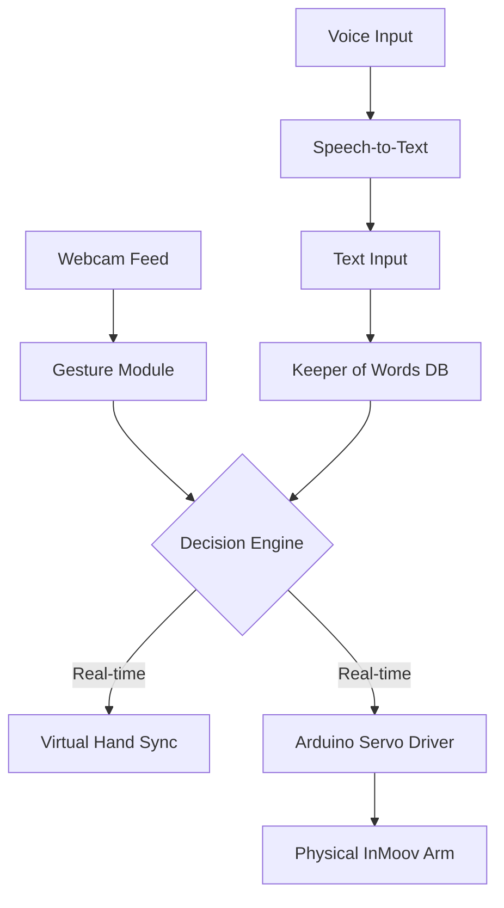
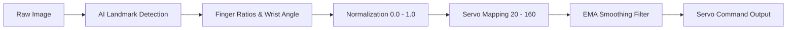
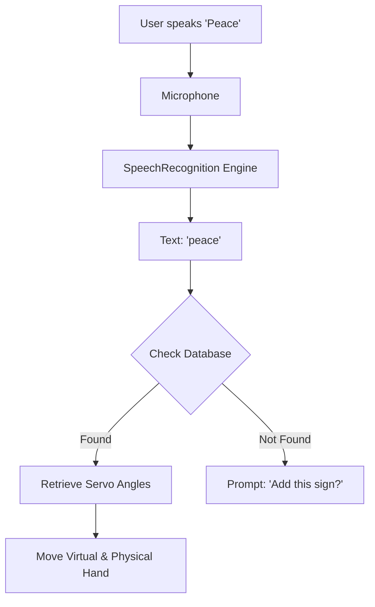
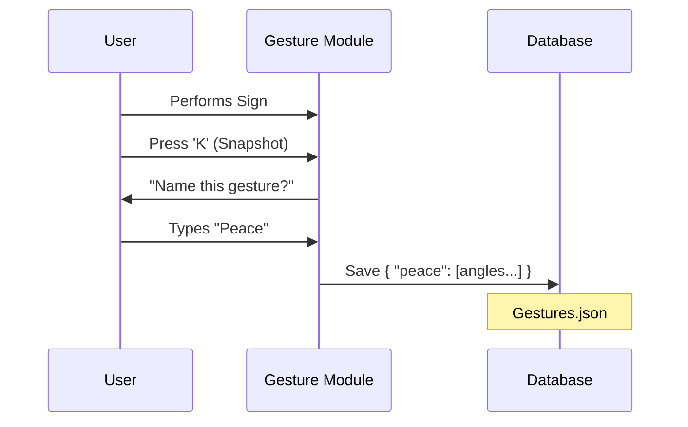

# Chapter 3: Block Diagrams for InMoov Portfolio

## 1. Overall System Architecture

## 2. The Gesture Processing Pipeline (The "Assembly Line")

## 3. Voice Module Workflow

## 4. Database "Keeper of Words" Sequence

