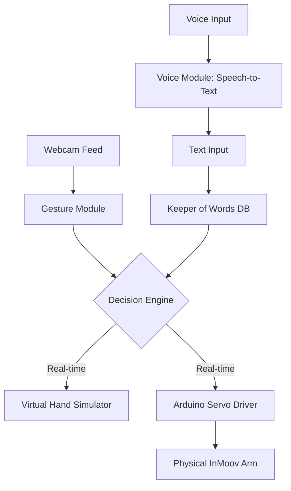
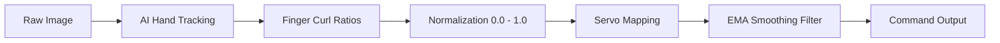
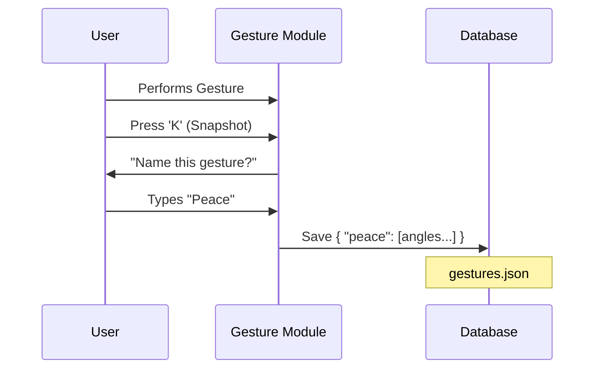

# InMoov Portfolio: Chapter 3 Block Diagrams

You can copy and paste the code blocks below into the [Mermaid Live Editor](https://mermaid.live/) to generate high-quality images for your report and slides.

## 1. Overall System Architecture
This diagram shows how data flows from your hand/voice into the InMoov brain and out to the robot.

## 2. The Gesture Processing Pipeline ("The Assembly Line")
This diagram explains the mathematical journey from a raw camera image to a smooth servo movement.

## 3. Database: "Keeper of Words" Workflow
This diagram explains how signs are recorded and retrieved for later use.

