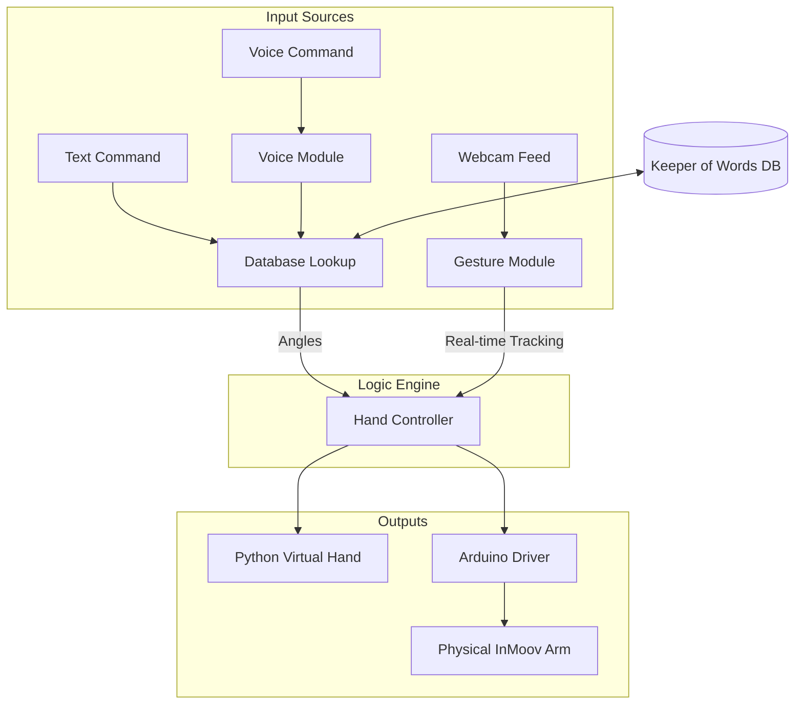
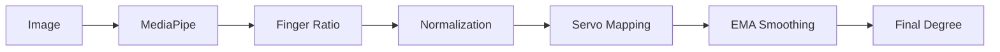
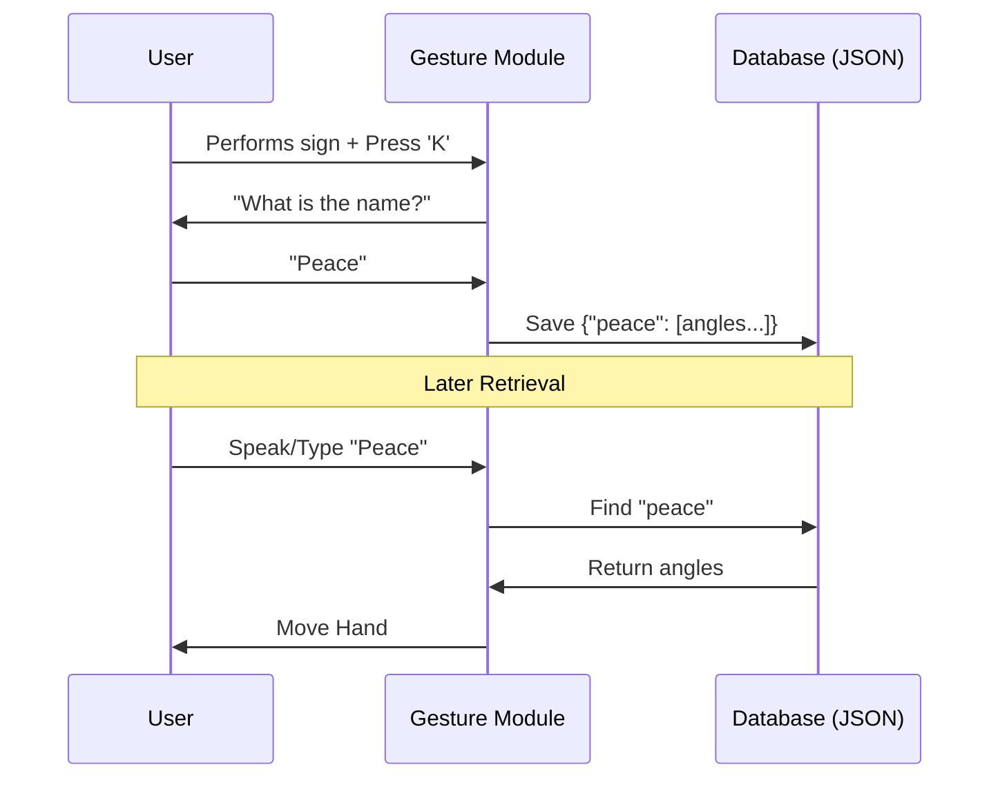

# InMoov Project: Chapter 3 Visual Assets

## 1. System Block Diagram
This diagram shows how all modules (Voice, Text, Database, and Physical Hand) talk to each other.

## 2. Gesture Pipeline (Assembly Line)
The step-by-step math journey of a single finger.

## 3. Database Workflow
How we save and retrieve gestures.

